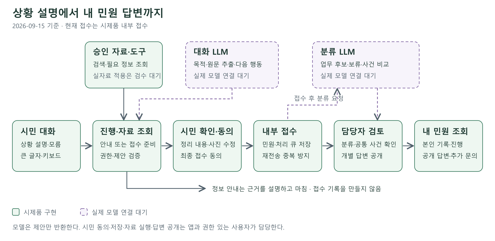

# 제2회 성남 x KAIST AI경진대회 예선 제안서 원고

2026-09-15 · 일반부 · 정식 제출서식의 항목 순서에 맞춘 검토용 원고

| 팀명 | 과제명 |
| --- | --- |
|  | 부서 선택의 어려움을 줄이는 성남시 대화형 민원 안내·접수 지원 AI 에이전트 |

팀명은 확인 전이므로 비워 두었다. 이 파일은 한글 문서에 편집할 원고이며, HWPX의 글꼴·줄간격·
페이지 수를 검증한 제출 파일은 아니다. 제출 편집 시 본문 10쪽 이내·휴먼명조 13pt·줄간격 160%를
적용한다. 원고를 옮길 때 이 편집 메모는 제외한다. [서식·공고 검토](CONTEST_SUBMISSION_NOTES.md) 참고.

## 1. 프로젝트 정의

### 가. 제안배경

시민이 불편을 설명할 수 있어도 담당 부서나 민원 유형, 필요한 서류를 미리 알기는 어렵다.
복잡한 메뉴와 입력 절차는 디지털 행정에 익숙하지 않은 사람에게 추가 부담이 될 수 있다.
프로젝트는 '부서를 먼저 찾는 과정'을 '내 상황을 말하는 과정'으로 바꾸는 데서 출발했다.

담당자 측에서는 장소·대상·요구가 불분명한 접수에 다시 질문하거나, 같은 현장의 여러 제보를
반복 확인하는 비용을 줄이고자 한다. 이는 현재 검증할 문제 가설이다. 성남시의 이탈률,
보완 문의 빈도나 업무 절감 수치를 측정한 것으로 제시하지 않는다.

기존 [업무 프로세스 조사](SEONGNAM_MINWON_WORKFLOW_RESEARCH.md)와
[업무·관할 검수](SEONGNAM_DATA_REVIEW.md)를 출발 자료로 사용하고,
실제 병목은 시민 과제 관찰과 담당자 업무 비교로 확인한다.

성남시는 같은 생활불편도 구·시설·관리주체에 따라 확인해야 할 업무 경계가 있다. 팀의 공식
업무분장 대조에서는 도로와 보도, 가로등과 다른 조명, 공공 놀이터와 공동주택 시설을 구분할
필요가 확인됐다. 이는 조사 후보이며 최종 소관 판정은 아니다. 시민에게 부서를 직접 찾도록
요구하는 부담을 줄이면서, 시스템도 확인되지 않은 관할을 단정하지 않는 접근이 필요하다.
근거는 [대표 업무 검토](SEONGNAM_PILOT_SERVICES.md)에 기록했다.

팀은 수정·중원·분당구의 업무표를 대조했고, 분당구의 빗물받이 업무가 보도관리팀 항목에
표시되는 등 시설에 따른 구분을 검토했다. 이런 근거로 시설 종류와 위치를 필요한 만큼 묻고,
확인하지 못한 관리 책임은 담당자 검토로 남긴다. 부서명을 단순히 많이 등록하는 것으로
지역성을 대신하지 않는다. [하수도·시설 범위 검토](SEONGNAM_DATA_REVIEW.md) 참고.

### 나. 프로젝트 개요

**성남 민원 AI: 부서를 몰라도 상황을 말하면 안내와 민원 준비를 돕는 시민 에이전트**

시민이 자신의 상황을 일상적인 말로 설명하면 AI가 정보 안내와 민원 접수 의사를 구분하고,
필요한 근거를 찾아 설명하거나 부족한 정보를 물어 민원 초안을 준비하는 서비스를 제안한다.
시민은 정리된 내용과 사진을 확인·수정한 뒤 접수에 동의하고, 이후 진행과 답변을 조회한다.
담당자는 필요한 정보가 정리된 민원을 검토하고 같은 현장의 여러 제보를 함께 관리한다.

현재 시민·담당자 시제품과 모델 연결부를 구현했다. 실제 동아리 모델, 검수된 공식 자료 적용,
기관 시스템 연결과 효과 검증을 단계적으로 완성한다.

**차별성·필요성과 핵심 특징**

주요 대상은 행정 용어와 온라인 서식에 익숙하지 않은 시민, 그리고 민원 접수·검토·답변을
담당하는 실무자다. 시민이 부서를 선택할 필요 없이 다음 흐름으로 이용하도록 설계한다.

1. **상황 설명:** 자유롭게 입력하거나 홈의 상황을 선택한다.
2. **안내·접수 의사 확인:** 제도·방법 질문은 근거 안내로, 불편 해결 요청은 민원 준비로 이어간다.
3. **필요 정보 보완:** 이미 말한 내용은 활용하고 한 번에 한 가지를 묻는다. 모름·건너뛰기와
   정정을 지원하며, 사진은 가능한 경우 제공한다.
4. **시민 확인:** 정리한 사실과 원문 근거, 내용·장소·사진을 보고 수정한다. 마지막 접수 동의를 받는다.
5. **처리·조회:** 담당자가 분류 후보와 내용을 검토하고 답변을 공개하면 시민이 본인 기록에서 확인한다.

현재 접수는 시제품 내부 접수다. 정식 기관 연계 시에는 기관의 수신 응답을 확인한 뒤에만
공식 접수 완료를 표시한다. 복지 질문은 신청 경로·근거를 안내하며 개인의 자격을 확정하지 않는다.

## 2. 기술 구현 계획

### 가. AI분야

대화 LLM은 목적 확인·원문에서 정보 추출·다음 질문·근거 검색 계획을 담당한다.
분류 LLM은 업무·부서 후보와 보류를 제안하고, 같은 사건인지 비교하는 보조 작업에도 활용한다.
추출·계획·분류·비교의 네 작업은 두 모델 역할로 나누며, 작업마다 새 모델을 추가하지 않는다.

모델은 정해진 JSON으로 제안하고 앱이 자료 검색·권한·허용 ID·초안 버전·동의·저장을 검사한다.
실제 제출·부서 확정·답변 공개·사건 연결 권한을 모델에게 직접 주지 않는다.
대화 에이전트는 필요 정보를 도구로 조회할 수 있고, MCP는 승인 자료를 읽는 도구 연결에 활용한다.

현재 시제품의 기본 분류는 API 키 없이 실행 가능한 규칙 방식이다. 목표인 문맥 기반 LLM 분류의
성능으로 제시하지 않는다. 실제 모델은 기존 HTTP 계약에 연결하며, 기본 모델의 실패를 측정한 뒤
파인튜닝 필요성과 범위를 결정한다. 서버 사양·모델 선택·학습 일정은 아직 미정이다.

한국어 지시 이행, 원문 보존, JSON 준수, 이용 조건, 장비에서의 지연·메모리를 기준으로
모델을 선정한다. 장비 사양과 모델명은 아직 확정하지 않았다. 현재 추출은 원문의 정확한 인용을
요구하므로 자유로운 문장 재작성과 같은 평가로 취급하지 않는다. 준비 여부와 시민 동의도 구분한다.

### 나. 프로토타입 설계도

그림 1. 초록색은 구현된 시제품 경로, 보라색 점선은 실제 모델 연결 대기 요소다.
자료 조회 도구는 구현했으며 실제 성남 자료 적용은 검수 후 진행한다.
편집 가능한 [SVG 원본](assets/proposal-architecture.svg)도 제공한다.

시민 설명 → 목적·필요 정보 확인 → 내용·사진 확인과 동의 → 내부 접수 → 담당자 검토·답변
→ 시민 본인 조회로 이어진다. 정보 요청은 접수 기록을 만들지 않고 근거 안내로 마칠 수 있다.

기술 구성은 FastAPI, Pydantic, SQLAlchemy·SQLite, Jinja2·JavaScript 기반 웹 화면이다.
앱이 세션·초안 버전·권한·도구 실행·동의·저장을 관리하고 모델은 제안을 반환한다.
분류는 내부 접수 후 큐에서 처리해 접수 요청이 모델 응답을 기다리지 않도록 설계했다.

### 다. 주요 기술 및 기능

| 기능 | 시민·담당자에게 주는 가치 | 현재 단계 |
| --- | --- | --- |
| 대화 중심 접수 | 긴 서식과 부서 탐색 부담을 줄이고 설명에 집중 | 시연 대화·수정·내부 접수·조회 구현 |
| 원문 기반 입력 정리 | 어떤 표현을 근거로 이해했는지 확인하고 잘못된 정리를 고침 | 확인 UI·추출 계약 구현, 실제 LLM 연결 대기 |
| 근거 있는 정보 안내 | 안내로 해결할 질문은 승인된 자료와 출처로 응답 | 로컬 검색·출처 기능 구현, 실제 자료 적용 검수 대기 |
| LLM 분류 제안 | 문맥을 보고 업무·부서 후보를 제시하고 애매하면 보류 | 분류 계약·검증·큐 구현, 실제 추론·성능 평가 대기 |
| 같은 현장 공동 처리 | 개별 민원을 보존하면서 공통 현장의 조치를 관리 | 담당자 연결·분리·진행·공개 구현, 실제 업무 절감 미측정 |
| 접근성과 오류 복구 | 큰 글자·키보드·모름·이어보기로 입력 중단 부담을 줄임 | 화면 대응·자동 검사, 참여자·보조기기 검증 대기 |

**성남 자료와 독립 평가**

성남시 전체 민원 분류를 완성했다고 전제하지 않고, 생활불편 8개와 복지 안내 4개를 대표 범위로
선정했다. 출처·시행일·자료 이용 범위·부서·시설 관할을 검수한 뒤 해당 버전만 제품에 적용한다.
조사 후보의 업무 ID와 실제 기관 코드의 대응도 별도로 확인한다.

기존 합성 대화 100건은 개발·회귀 검토용 초안이다. 새 독립 시험은 학습 담당과 분리해 사람이
정답을 검수하고 같은 사건의 변형이 학습·시험 양쪽에 들어가지 않도록 관리한다.
첨부 [평가 가이드 검토](CHAT_EVAL_GUIDELINE_REVIEW.md)에 따라 먼저 실제 모델 입력·출력,
준비 여부와 동의의 차이, 질문·개인정보·안전 응답 기준을 맞춘다. 아직 gold를 승인하거나
실제 모델 성능 점수를 얻은 것은 아니다.

## 3. 프로젝트 계획(안)

### 가. 예상 결과물

1. 시민이 부서를 선택하지 않고 안내·민원 준비·확인·내부 접수·조회하는 웹 시제품.
2. 두 모델 역할과 검수 자료를 연결한 대표 생활민원 한 건의 통합 시연 및 오류 복구 기록.
3. 성남 업무·관할·질문 자료의 검수 버전, 모델 계약과 독립 시험의 검토·예측·평가 기록.
4. 담당자 답변·공통 현장 사건 관리 도구와 시민·담당자 과제의 비교 결과.
5. 구현 코드, 실행 설명, 발표자료와 시연 영상. 미구현·미검증 범위도 함께 공개.

**기대 효과와 측정 방법**

| 기대하는 변화 | 측정 방법 | 현재 결과 |
| --- | --- | --- |
| 시민이 스스로 안내·접수·조회 완료 | 자력/도움 후/미완료, 소요시간, 도움 요청·중단 지점 | 실제 참여자 미확보·미측정 |
| 불필요한 질문과 재입력 감소 | 이미 제공한 항목의 재질문, 수정·재입력 횟수 | 자동 회귀 검사만 수행, 실제 이용 비교 미측정 |
| 정확하고 신중한 모델 제안 | 업무·상황 유형별 분류·추출·보류, 근거 없는 사실·개인정보·안전 응답 검토 | 계약·초안 자료 준비, 실제 LLM 미평가 |
| 담당자 반복 업무 감소 | 같은 과제의 보완 문의·재분류·현장 처리 단계 비교 | 도구 구현, 실무자 비교 미실시 |
| 장애 중에도 기록과 동의 보존 | 재전송·늦은 결과·조회 권한·접수 동의 회귀 검사 | 구현 커밋의 CI 통과, 운영 환경 검증은 별도 |

수치 목표는 기준선 측정 후 비교 실행 전에 표본·버전과 함께 고정한다. 자동 검사 성공을
실제 시민 편의나 공무원 업무 절감 수치로 바꾸어 발표하지 않는다.

### 나. 프로젝트 스케줄

다음은 공고 일정에 맞춘 추진안이다. 실제 모델 연결은 현재 보류하며, 장비와 자료 검수 조건이
준비된 경우에만 해당 단계를 진행한다. 준비되지 않으면 구현 수준을 그대로 설명하고
합성 시연을 실제 모델 성능으로 표시하지 않는다.

| 기간 | 주요 작업 | 완료 결과 |
| --- | --- | --- |
| 9.15~9.18 · 예선 | 일반부 원고·설계도·구현 근거 정리, 팀 정보·별도 서류·서식 확인 | 예선 자료 구성. 제출은 팀이 별도로 수행 |
| 9.19~10.2 | 시민 화면의 확인된 막힘 개선, 평가 계약·첫 업무 자료 검수, 모델 연결 조건 확인 | 첫 통합 사례의 범위·계약·미해결 사항 고정 |
| 10.3~10.9 · 본선 진출 시 | 준비된 모델·자료로 대표 민원 연결, 오류 복구와 참여자·담당자 과제 수행 | 실제 수행 결과·실패 기록 |
| 10.10~10.16 · 본선 진출 시 | 주요 실패 수정, 모델·자료·앱 버전 고정, 발표·영상·코드 정리 | 본선 발표·시연 자료 |
| 10.17~10.24 · 본선 진출 시 | 발표 연습, 같은 현장·정보 부족·장애 시나리오 재현 | 현장 발표·시연 |

**팀원 4명의 역할**

| 역할 | 담당 결과 |
| --- | --- |
| A 기획·업무/데이터 | 문제·업무 검수, 제안서 근거, 독립 시험 정답 보관·승인 |
| B 시민 UI·접근성 | 화면·질문·오류 복구, 시민 관찰, 중요 평가 문구의 두 번째 검수 |
| C 앱·데이터 연계 | 자료 적용·권한·저장·JSON 계약·검사, 이후 모델·기관 연결 |
| D 모델·학습 | 대화·분류 모델과 학습·개발 자료, 버전별 예측과 오류 분석 |

최종 시험 정답과 원문은 모델 학습·프롬프트 개선에 쓰지 않는다. 팀의 다음 작업과 의존성은
[TASKS](../TASKS.md)에 모으며, 각 작은 작업이 끝나면 시민 전체 흐름에 필요한 다음 병목으로 돌아간다.

## 4. 기타

**구현 근거와 재현성**

소스는 [mean1AI 저장소](https://github.com/dltlghk5571/mean1AI)에서 관리하고 Git Flow를 적용한다.
앱 기준 커밋은 `1a45d4feaf8bdb9d2815108089f45fbbda5ae43d`이며
[CI 검사](https://github.com/dltlghk5571/mean1AI/actions/runs/34933357642)에서 전체 테스트,
브라우저·정적 검사·합성 평가 구조를 확인했다. 자동 검사 통과는 실제 시민 편의나
공무원 업무 절감의 실증 결과를 뜻하지 않는다.

**출처·정보 보호와 확장 조건**

새 모델·데이터·외부 자료는 이용 조건과 출처를 확인하고 공개 제한을 표시한다.
전화번호·이메일·주민등록번호 형식 마스킹, 본인 조회·동의·버전·중복 저장·감사를 검사한다.
이름·사진·문맥까지 완전 익명화하는 기능은 아니므로 검증 자료에는 명백한 가상 정보만 사용한다.
사진은 현재 모델에 전달하지 않는다. 정식 기관 제출·정부 인증·운영 배포는 연결되지 않았다.
시민의 권리 판단·자동 반려·종결은 하지 않는다. 전체 민원 확대, 음성·다국어, 사진 AI 판독은
대표 흐름의 실제 검증 이후 확장 대상으로 둔다.

참고 자료: [공식 대회 안내](https://xai.kaist.ac.kr/ai-contest/2026/),
[구현 현황](PROJECT_STATUS.md), [성남 업무 조사](SEONGNAM_MINWON_WORKFLOW_RESEARCH.md),
[자료 검수](SEONGNAM_DATA_REVIEW.md), [모델 계약](MODEL_GATEWAY.md),
[평가 가이드 대조](CHAT_EVAL_GUIDELINE_REVIEW.md), [사용성 과제](CITIZEN_USABILITY_TEST.md).
